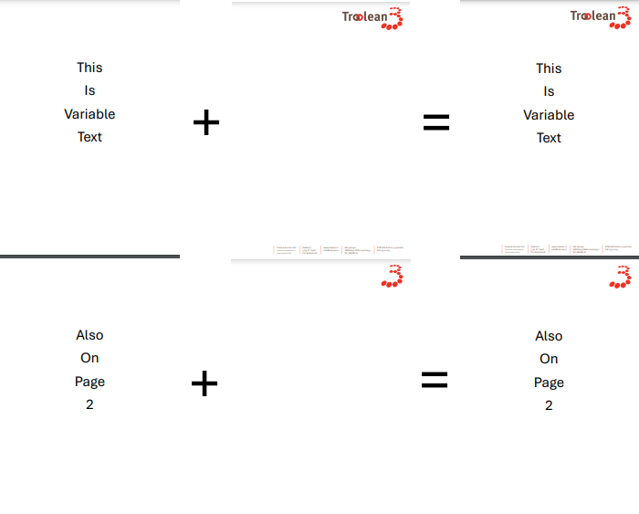
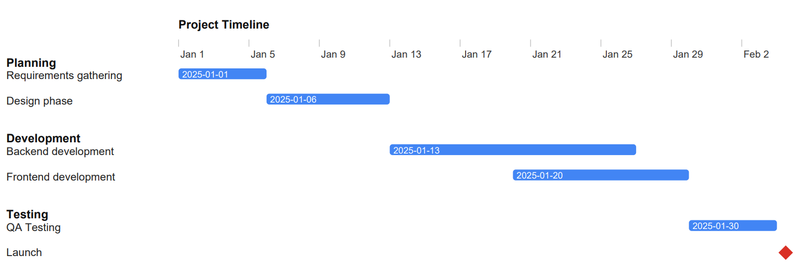
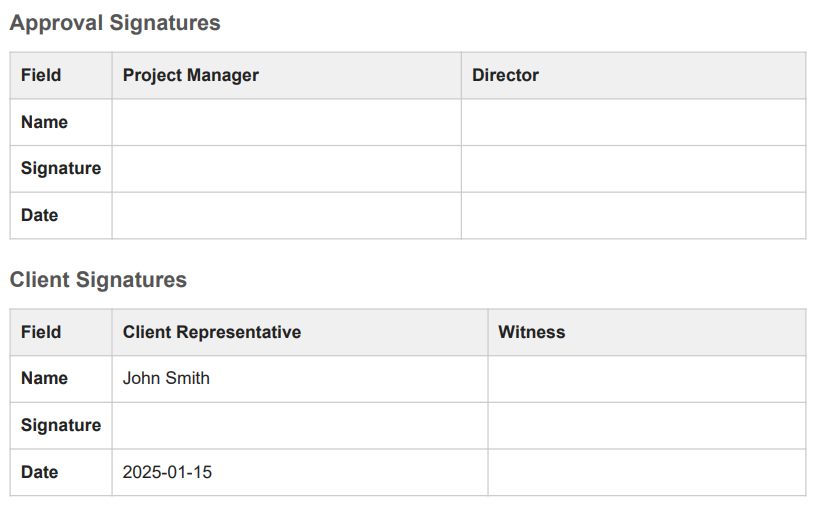

# OverlayPDF

## Author

Ewart Nijburg<br>
Troolean

## Project Overview

OverlayPDF is a .NET 10 application designed to overlay text PDFs with predefined template PDFs. It uses the iText library to merge PDFs, applying a specific template to the first page and a different template to subsequent pages. This is useful for creating consistent document formats, such as adding letterheads or footers to documents.

## Key Features

- Overlay text PDFs with template PDFs.
- Apply different templates to the first page and continuation pages.
- Configurable template paths via `appsettings.json`.
- Pass a markdown file (*.md) as argument and it will render as pdf based on the templates



## Installation

1. Clone the repository
2. In the project root, run `dotnet publish`
3. Navigate to the publish directory and Configure the application by editing `appsettings.json`

```
{
  "Logging": {
    "LogLevel": {
      "Default": "Information",
      "Microsoft": "Warning",
      "Microsoft.Hosting.Lifetime": "Warning"
    }
  },
  "PdfOverlayOptions": {
    "template_1": {
      "TemplateDirectory": "C:\\Temp\\Templates",
      "FirstPageTemplate": "InitialPageTemplate.pdf",
      "ContinuationPageTemplate": "ContinuationPageTemplate.pdf",
      "DefaultFontFamily": "Arial",
      "FirstPageTopMarginPoints": 0,
      "FirstPageBottomMarginPoints": 0,
      "ContinuationTopMarginPoints": 72,
      "ContinuationBottomMarginPoints": 36
    },
    "template_2": {
      "TemplateDirectory": "C:\\Temp\\Templates",
      "FirstPageTemplate": "InitialPageTemplate.pdf",
      "ContinuationPageTemplate": "ContinuationPageTemplate.pdf",
      "DefaultFontFamily": "Arial",
      "FirstPageTopMarginPoints": 0,
      "FirstPageBottomMarginPoints": 0,
      "ContinuationTopMarginPoints": 72,
      "ContinuationBottomMarginPoints": 36
    }
  }
}
```

4. Run the application with `OverlayPDF.exe "path to pdf with text"`
5. Create a shortcut on the desktop and next time drop a PDF file on the shortcut to overlay it with the templates.
6. A new pdf will be created in the same directory as the input pdf with the suffix `_overlay`.

## Markdown Support

When passing a markdown file (*.md) as input, OverlayPDF will render it as a PDF using the configured templates. The application supports standard Markdown syntax via the Markdig library with advanced extensions, plus several custom features:

### Standard Markdown Features

All standard Markdown features are supported through Markdig's advanced extensions, including:

- **Headings** (`# H1`, `## H2`, `### H3`, etc.)
- **Emphasis** (`*italic*`, `**bold**`, `***bold italic***`)
- **Lists** (ordered and unordered)
- **Links** (`[text](url)`)
- **Images** (``)
- **Code blocks** (fenced with ``` or indented)
- **Tables** (GitHub-flavored markdown tables)
- **Blockquotes** (`> quote`)
- **Horizontal rules** (`---`, `***`, `___`)

### Custom Features

#### 1. Placeholders

Simple text placeholders are automatically replaced during PDF generation:

- `[Date]` - Replaced with the current date in short date format

**Example:**
```markdown
Document generated on [Date]
```

#### 2. Page Breaks

Use four or more hyphens on a line by itself to force a page break:

```markdown
Content on page 1

----

Content on page 2
```

#### 3. Timeline Diagrams

Create visual Gantt-style timelines using fenced code blocks with the `timeline` language identifier:

````markdown
```timeline
title Project Timeline
section Planning
Requirements gathering :p1, 2025-01-01, 5d
Design phase :p2, 2025-01-06, 7d
section Development
Backend development :d1, 2025-01-13, 14d
Frontend development :d2, 2025-01-20, 10d
section Testing
QA Testing :t1, 2025-01-30, 5d
Launch :milestone, 2025-02-04, m
```
````



**Timeline Syntax:**
- `title` - Optional timeline title
- `section` - Creates a new section in the timeline
- Task format: `Label :id, start-date, duration`
  - `Label` - Task description
  - `id` - Unique identifier (e.g., p1, d1, t1)
  - `start-date` - Start date in YYYY-MM-DD format (also supports other common formats)
  - `duration` - Duration as a number followed by:
    - `d` for days (e.g., `5d`, `0.5d`)
    - `h` for hours (e.g., `8h`)
    - `m` or `milestone` for milestones (displayed as red diamonds)

#### 4. Signature Blocks

Create signature forms using fenced code blocks with the `signatures` language identifier. These render as HTML form fields:

````markdown
```signatures
## Approval Signatures

| Field         | Project Manager  | Director |
|---------------|------------------|----------|
| **Name**      |                  |          |
| **Signature** |                  |          |
| **Date**      |                  |          |

---

## Client Signatures

| Field         | Client Representative | Witness |
|---------------|-----------------------|---------|
| **Name**      | John Smith            |         |
| **Signature** |                       |         |
| **Date**      | 2025-01-15            |         |
```
````



**Signature Block Syntax:**
- Use `##` or `###` headings to create section titles
- Use markdown tables with at least 2 columns:
  - First column: Field names (typically in **bold**)
  - Subsequent columns: Signatory names (table headers)
- Cell values:
  - Empty cells, cells with `...`, or whitespace-only cells become fillable form fields
  - Pre-filled values remain as static text (e.g., `John Smith`, `2025-01-15`)
- Separate multiple signature sections with `---` (horizontal rule)

### Unicode and Special Characters

The application automatically handles problematic Unicode characters that may not render well in PDFs:

- **Arrows** are converted to ASCII equivalents (→ becomes \->)
- **Mathematical symbols** are converted to HTML entities (≠ becomes '\&ne;')
- **Currency symbols** are preserved with HTML entities (€ becomes '\&euro;')
- **Smart quotes** are converted to HTML entities
- Most **accented characters** and **Latin extended characters** are preserved

This ensures maximum compatibility across different PDF viewers and font sets.

### Styling

The application applies default styling to markdown content:

- **Font**: Configurable via `DefaultFontFamily` in appsettings.json (default: Arial)
- **Font Size**: 11pt body text
- **Headings**: 
  - H1: 22pt bold
  - H2: 16pt bold
  - H3: 13pt bold
- **Tables**: Styled with borders, zebra striping, and padding
- **Code blocks**: Monospace font with background color
- **Line height**: 1.45 for improved readability

## The project uses the following libraries

- The awesome iText library - https://itextpdf.com/
