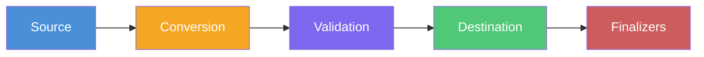

# OverlayPDF

> A .NET 10 command-line tool for overlaying text PDFs with branded templates — and for converting Markdown to professionally styled PDFs with timelines, signature blocks, and flowcharts.

[](https://dotnet.microsoft.com/)
[](https://itextpdf.com/)
[](LICENSE)

---

## Table of Contents

- [Overview](#overview)
- [Key Features](#key-features)
- [Getting Started](#getting-started)
  - [Prerequisites](#prerequisites)
  - [Installation](#installation)
  - [Usage](#usage)
- [Configuration](#configuration)
- [Markdown Support](#markdown-support)
  - [Standard Markdown](#standard-markdown)
  - [Placeholders](#placeholders)
  - [Page Breaks](#page-breaks)
  - [Timeline Diagrams](#timeline-diagrams)
  - [Signature Blocks](#signature-blocks)
  - [Mermaid Flowcharts](#mermaid-flowcharts)
  - [Unicode and Special Characters](#unicode-and-special-characters)
  - [Styling](#styling)
- [Known Issues](#known-issues)
- [Acknowledgements](#acknowledgements)
- [License](#license)
- [Author](#author)

---

## Overview

OverlayPDF merges your content PDFs with pre-designed template PDFs — applying one template to the first page and another to continuation pages. This makes it easy to produce documents with consistent branding such as letterheads, footers, and page borders.

It also converts Markdown files directly to PDF, complete with template overlays, and supports custom extensions for **timeline diagrams**, **signature blocks**, and **Mermaid flowcharts**.


## Key Features

| Feature | Description |
|---|---|
| **Template Overlay** | Apply separate first-page and continuation-page templates to any text PDF |
| **Markdown → PDF** | Render `.md` files as fully styled PDFs with template overlays |
| **Timeline Diagrams** | Gantt-style timelines with sections, tasks, milestones, and durations |
| **Signature Blocks** | Fillable AcroForm signature fields generated from Markdown tables |
| **Mermaid Flowcharts** | Native SVG rendering of flowcharts — no external tools required |
| **Page Numbering** | Configurable alignment (Left / Center / Right) on continuation pages |
| **Multiple Templates** | Define named template configurations in `appsettings.json` |
| **Drag & Drop** | Create a desktop shortcut and drop files onto it for one-click processing |

---

## Getting Started

### Prerequisites

- [.NET 10 SDK](https://dotnet.microsoft.com/download/dotnet/10.0) or later

### Installation

```bash
# Clone the repository
git clone https://github.com/enijburg/OverlayPDF.git
cd OverlayPDF

# Build and publish
dotnet publish -c Release
```

### Usage

```bash
# Overlay a PDF with the default template
OverlayPDF.exe "path/to/document.pdf"

# Overlay using a named template
OverlayPDF.exe --template template_1 "path/to/document.pdf"

# Convert Markdown to PDF with a template
OverlayPDF.exe --template template_1 "path/to/document.md"

# Convert Markdown to PDF without a template
OverlayPDF.exe --no-template "path/to/document.md"
```

The output file is created in the same directory as the input with the suffix `_overlay` (e.g., `document_overlay.pdf`).

> **Tip:** Create a desktop shortcut to `OverlayPDF.exe` and drag-and-drop PDF or Markdown files onto it for quick processing.

---

## Configuration

Edit `appsettings.json` in the publish directory to define one or more named template configurations:

```json
{
  "PdfOverlayOptions": {
    "template_1": {
      "TemplateDirectory": "C:\\Temp\\Templates",
      "FirstPageTemplate": "InitialPageTemplate.pdf",
      "ContinuationPageTemplate": "ContinuationPageTemplate.pdf",
      "DefaultFontFamily": "Arial",
      "FirstPageTopMarginPoints": 0,
      "FirstPageBottomMarginPoints": 0,
      "ContinuationTopMarginPoints": 72,
      "ContinuationBottomMarginPoints": 36,
      "LeftMarginPoints": 60,
      "RightMarginPoints": 60,
      "AddPageNumbers": true,
      "PageNumberAlignment": "Right"
    }
  }
}
```

| Setting | Description | Default |
|---|---|---|
| `TemplateDirectory` | Path to the folder containing template PDFs | — |
| `FirstPageTemplate` | Template PDF applied to page 1 | — |
| `ContinuationPageTemplate` | Template PDF applied to pages 2+ | — |
| `DefaultFontFamily` | Font used for Markdown rendering | `Arial` |
| `FirstPageTopMarginPoints` | Top margin on page 1 (in points) | `0` |
| `FirstPageBottomMarginPoints` | Bottom margin on page 1 (in points) | `0` |
| `ContinuationTopMarginPoints` | Top margin on pages 2+ (in points) | `72` |
| `ContinuationBottomMarginPoints` | Bottom margin on pages 2+ (in points) | `36` |
| `LeftMarginPoints` | Left margin for Markdown content (in points) | `60` |
| `RightMarginPoints` | Right margin for Markdown content (in points) | `60` |
| `AddPageNumbers` | Show page numbers on continuation pages | `false` |
| `PageNumberAlignment` | Horizontal position: `Left`, `Center`, or `Right` | `Center` |

---

## Markdown Support

When a Markdown file (`.md`) is passed as input, OverlayPDF renders it to PDF using the configured templates. The application leverages the [Markdig](https://github.com/xoofx/markdig) library with advanced extensions, plus several custom features.

### Standard Markdown

All standard Markdown features are supported through Markdig's advanced extensions:

- **Headings** (`# H1` through `###### H6`)
- **Emphasis** (`*italic*`, `**bold**`, `***bold italic***`)
- **Lists** (ordered and unordered)
- **Links** (`[text](url)`) and **Images** (``)
- **Code blocks** (fenced with ` ``` ` or indented)
- **Tables** (GitHub-flavored Markdown)
- **Blockquotes** (`> quote`)
- **Horizontal rules** (`---`, `***`, `___`)

### Placeholders

Text placeholders are replaced automatically during PDF generation:

| Placeholder | Replaced With |
|---|---|
| `[Date]` | Current date in short date format |

```markdown
Document generated on [Date]
```

### Page Breaks

Insert a manual page break by placing four or more hyphens on a line by themselves:

```markdown
Content on page 1

----

Content on page 2
```

### Timeline Diagrams

Create visual Gantt-style timelines using fenced code blocks with the `timeline` language identifier:

````markdown
```timeline
title Project Timeline
section Planning
Requirements gathering :p1, 2025-01-01, 5d
Design phase :p2, 2025-01-06, 7d
section Development
Backend development :d1, 2025-01-13, 14d
Frontend development :d2, 2025-01-20, 10d
section Testing
QA Testing :t1, 2025-01-30, 5d
Launch :milestone, 2025-02-04, m
```
````


**Syntax Reference**

| Element | Format | Example |
|---|---|---|
| Title | `title <text>` | `title Project Timeline` |
| Section | `section <text>` | `section Planning` |
| Task | `Label :id, start-date, duration` | `Design :p2, 2025-01-06, 7d` |
| Milestone | `Label :id, date, m` | `Launch :m1, 2025-02-04, m` |

Supported duration units: `d` (days, e.g. `5d`, `0.5d`), `h` (hours, e.g. `8h`), `m` (milestone).

### Signature Blocks

Create fillable signature forms using fenced code blocks with the `signatures` language identifier:

````markdown
```signatures
## Approval Signatures

| Field         | Project Manager  | Director |
|---------------|------------------|----------|
| **Name**      |                  |          |
| **Signature** |                  |          |
| **Date**      |                  |          |

---

## Client Signatures

| Field         | Client Representative | Witness |
|---------------|-----------------------|---------|
| **Name**      | John Smith            |         |
| **Signature** |                       |         |
| **Date**      | 2025-01-15            |         |
```
````


**Syntax Reference**

- Use `##` or `###` headings to create section titles.
- Use Markdown tables with at least two columns:
  - **First column** — field names (typically in **bold**).
  - **Remaining columns** — one per signatory (column headers become labels).
- Empty cells (or cells containing only `...` / whitespace) become **fillable AcroForm fields**.
- Pre-filled values remain as static text.
- Separate multiple signature sections with `---`.

### Mermaid Flowcharts

Create flowchart diagrams using fenced code blocks with the `mermaid` language identifier. Flowcharts are rendered natively to SVG — **no external tools required**.

````markdown

```mermaid
flowchart LR
    A[Source] --> B[Conversion]
    B --> C[Validation]
    C --> D[Destination]
    D --> E[Finalizers]

    style A fill:#4A90D9,color:#fff
    style B fill:#F5A623,color:#fff
    style C fill:#7B68EE,color:#fff
    style D fill:#50C878,color:#fff
    style E fill:#CD5C5C,color:#fff
```
````

**Syntax Reference**

| Element | Syntax | Example |
|---|---|---|
| Direction | `flowchart LR` / `TD` / `TB` / `RL` / `BT` | `flowchart LR` |
| Rectangle | `[text]` | `A[Source]` |
| Rounded | `(text)` | `B(Process)` |
| Diamond | `{text}` | `C{Decision}` |
| Stadium | `([text])` | `D([Terminal])` |
| Circle | `((text))` | `E((Hub))` |
| Solid arrow | `-->` | `A --> B` |
| Dashed arrow | `-.->` | `A -.-> B` |
| Thick arrow | `==>` | `A ==> B` |
| Edge label | <code>-->\|label\|</code> | <code>A -->\|yes\|B</code> |
| Styling | `style NodeId fill:#hex,color:#hex` | `style A fill:#4A90D9,color:#fff` |
| Subgraph | `subgraph Title ... end` | Group related nodes |

### Unicode and Special Characters

The application automatically converts problematic Unicode characters for maximum PDF compatibility:

| Category | Handling |
|---|---|
| Arrows (→, ←, ↔) | Converted to ASCII equivalents |
| Mathematical symbols (≠, ≤, ≥) | Converted to HTML entities |
| Currency symbols (€, £, ¥) | Preserved via HTML entities |
| Smart quotes (" " ' ') | Converted to HTML entities |
| Accented characters (é, ñ, ü) | Preserved as-is |

### Styling

Default styling applied to Markdown-generated PDFs:

| Element | Style |
|---|---|
| Body text | 11pt, configurable font family |
| H1 | 22pt bold |
| H2 | 16pt bold |
| H3 | 13pt bold |
| Tables | Borders, zebra-striped rows, padded cells |
| Code blocks | Monospace font with background color |
| Line height | 1.45 for improved readability |

---

## Known Issues

### AcroForm Fields Not Preserved During PDF Merge

When overlaying a PDF that contains AcroForm fields (fillable form fields) with template PDFs, the form fields are **not copied** to the final merged PDF. Only the visual appearance of the content is preserved.

**Impact:** Interactive form fields (text fields, checkboxes, signature fields, etc.) are flattened in the output — values are rendered as static text.

> **Note:** This does **not** affect signature blocks generated from Markdown using the `signatures` code block feature. Those fields use a different rendering path (HTML → PDF with AcroForm generation) and are preserved correctly.

**Workarounds:**
- For external PDFs with form fields, apply the fields after the merge operation.
- For signature blocks, use the Markdown `signatures` feature, which generates AcroForm fields that survive the overlay process.

<details>
<summary>Technical details</summary>

The overlay process uses `PdfFormXObject` and `CopyAsFormXObject()` to apply margins to the content PDF before merging with templates. This flattens the page content into an XObject, which does not preserve AcroForm fields. While `CopyPagesTo()` would preserve form fields, it does not support the margin adjustments required for proper template alignment. For Markdown-generated PDFs, this is solved by adding margins directly to the HTML before PDF conversion, bypassing `CopyAsFormXObject()` entirely.
</details>

---

## Acknowledgements

- [iText](https://itextpdf.com/) — PDF generation and manipulation
- [Markdig](https://github.com/xoofx/markdig) — Markdown parsing
- [Bouncy Castle](https://www.bouncycastle.org/csharp/) — Cryptography support

## License

This project is licensed under the [GNU Affero General Public License v3.0](LICENSE).

## Author

**Ewart Nijburg** — [Troolean](https://troolean.com)
